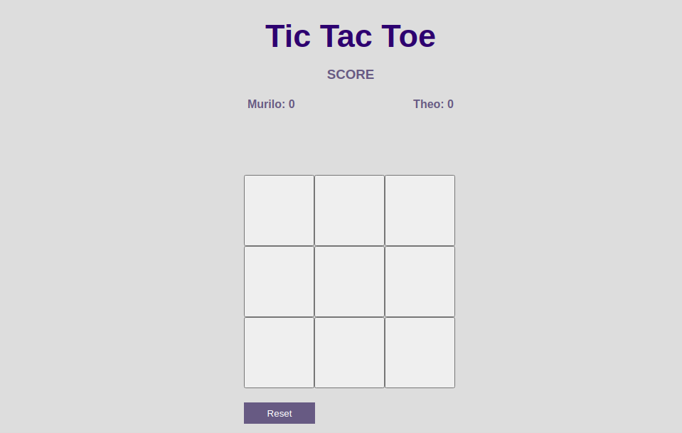

 

 

# Tic Tac Toe (Javascript)
In this project, we will be building a Tic Tac Toe game on Javascript.

# Rules and how to play it

- When you open the app, you and your friend should input your names and click "Start";
- Player 1 starts the match with the "X" color;
- Player 2 starts the match with the "O" color;
- A score and a message announcing the winner/draw are displayed at the top of the board;
- You can reset the game by pressing the "reset" button at the bottom of the board.

# Screenshot

## Live Demo

[Click for live webpage](https://cdn.githubraw.com/Theophile-Kango/js_tic_tac_toe/development/dist/index.html)

## Built With

- JavaScript
- Jest
- HTML5 
- CSS3

## Requirements

To run this app on your local computer you need the browser

### Setup

- Clone the repository on your local machine
- Cd into the folder
- Run `npm start`
- Open your browser and type `localhost:8080`
- To run tests, type `npm run test`

### Install

- Install VSCode or any code editor you like
- Install npm by running `npm install`

## Authors

👤  **Murilo Roque**

- Github: [@muriloroque](https://github.com/MuriloRoque)
- Twitter: [@MuriloRoquePai1](https://twitter.com/MuriloRoquePai1)
- Linkedin: [MuriloRoque](https://www.linkedin.com/in/murilo-roque-b1268741/)

👤  **Theophile Kango**

- Github: [@githubhandle](https://github.com/Theophile-Kango)
- Twitter: [@twitterhandle](https://twitter.com/Theophadh)
- Linkedin: [linkedin](https://www.linkedin.com/in/theophile-kango-b6b580194/)

## 🤝  Contributing

Contributions, issues and feature requests are welcome!

Feel free to check the [issues page](https://github.com/Theophile-Kango/js_tic_tac_toe/issues)
## Show your support

Give a ⭐️  if you like this project!
